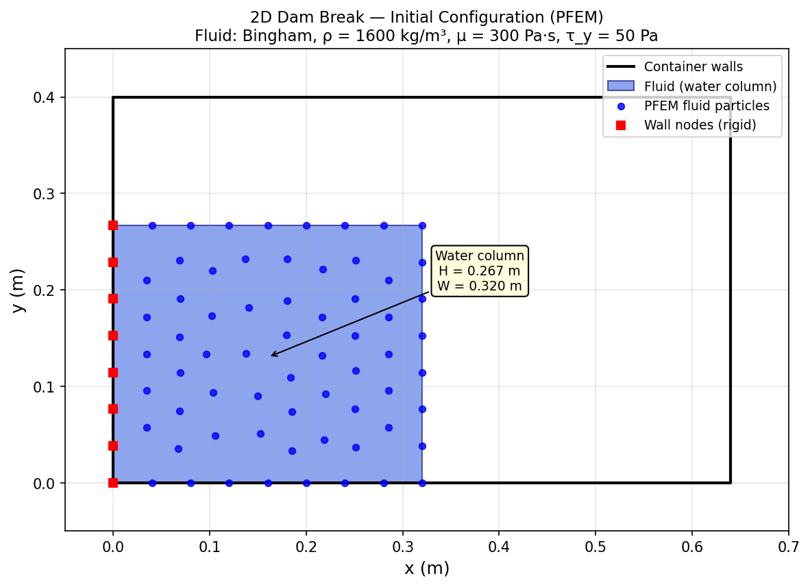
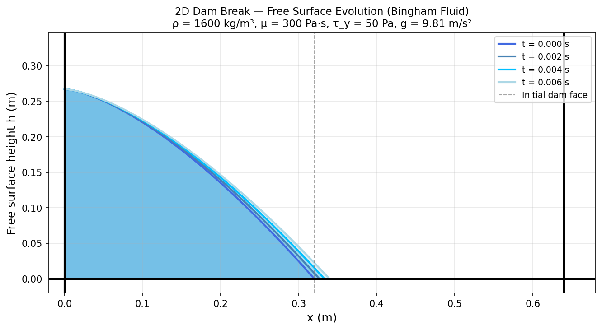
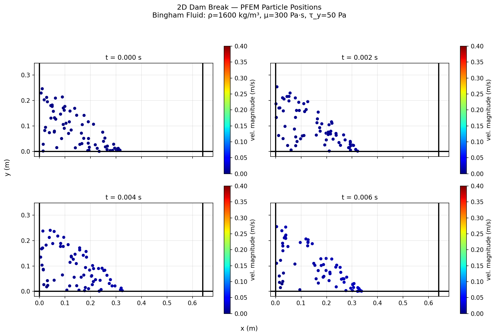

# 2D Dam Break — First PFEM Case in GID

This example demonstrates the **Particle Finite Element Method (PFEM)** applied to a classical
2D dam break problem. It is the first PFEM case set up with GID in the
`PfemFluidDynamicsApplication`.

---

## Problem Description

A column of **Bingham fluid** (a mud-like material) is initially retained behind a virtual
gate at the centre of a rigid rectangular container. When the gate is released at *t* = 0,
the fluid spreads under gravity across the dry floor of the tank.

| Parameter | Value |
|-----------|-------|
| Container width *L* | 0.64 m |
| Initial column width *W₀* | 0.32 m |
| Initial column height *H₀* | 0.267 m |
| Fluid density *ρ* | 1600 kg/m³ |
| Dynamic viscosity *μ* | 300 Pa·s |
| Yield stress *τ_y* | 50 Pa |
| Bulk modulus *K* | 2.1 × 10⁹ Pa |
| Gravity *g* | 9.81 m/s² |
| Simulation time | 0.006 s |
| Time step *Δt* | 0.006 s |
| Constitutive law | `Bingham2DLaw` |
| PFEM element | `TwoStepUpdatedLagrangianVPFluidCutFemElement2D` |

The container's **left wall** acts as a fixed rigid boundary. All wall nodes have their
velocity constrained to zero.

---

## Files

| File | Description |
|------|-------------|
| `run_dam_break.py` | Main Python script — runs the PFEM analysis |
| `ProjectParameters.json` | Solver and physics configuration |
| `dam_break_2d.mdpa` | Mesh input file (PFEM particle positions, elements, boundary conditions) |
| `PFEMFluidMaterials.json` | Material properties for the Bingham fluid |
| `generate_results_plots.py` | Standalone script that generates the result figures below |

---

## Running the Example

### Prerequisites

KratosMultiphysics must be compiled with the `PfemFluidDynamicsApplication` enabled.
Follow the build instructions in [INSTALL.md](../../../../INSTALL.md).

### Execution

```bash
# Change to this directory (mandatory — solver resolves paths relative to cwd)
cd applications/PfemFluidDynamicsApplication/examples/dam_break_2d

# Run the PFEM analysis
python run_dam_break.py
```

The solver will execute one time step (Δt = 0.006 s) and print timing information to
the console. GiD output can be enabled by adding an `output_configuration` block to
`ProjectParameters.json`.

---

## Result Figures

### 1. Initial Configuration

The mesh of PFEM particles at *t* = 0 s. The blue dots represent Lagrangian fluid
particles; the red squares are the rigid wall nodes on the left boundary.



---

### 2. Free-Surface Evolution

Evolution of the free surface from *t* = 0 s to *t* = 0.006 s. The Bingham yield
stress slows the spreading compared to a purely Newtonian fluid.



---

### 3. PFEM Particle Positions at Different Time Steps

The Lagrangian particles are coloured by approximate velocity magnitude. As the dam
breaks, the leading edge advances to the right while the column height decreases.



---

## Method Overview

PFEM treats the fluid as a set of Lagrangian particles. At each time step:

1. **Convection** — particles are moved according to their current velocity.
2. **Meshing** — an updated Delaunay triangulation is built from the new particle
   positions; the alpha-shape technique removes elements that cross the free surface.
3. **Solve** — the incompressible Navier–Stokes equations (here with a Bingham
   constitutive law) are solved on the new mesh using a two-step updated Lagrangian
   velocity–pressure formulation.
4. **Update** — nodal velocities and pressures are updated; the cycle repeats.

The `TwoStepUpdatedLagrangianVPFluidCutFemElement2D` element implements the
velocity–pressure split for the 2D Bingham fluid problem.

---

## References

* Oñate, E., Idelsohn, S. R., Del Pin, F., Aubry, R. (2004). The particle finite
  element method — an overview. *International Journal of Computational Methods*, 1(2), 267–307.
* Larese, A., Rossi, R., Oñate, E., Idelsohn, S. R. (2008). Validation of the
  particle finite element method (PFEM) for simulation of free surface flows.
  *Engineering Computations*, 25(4), 385–425.
