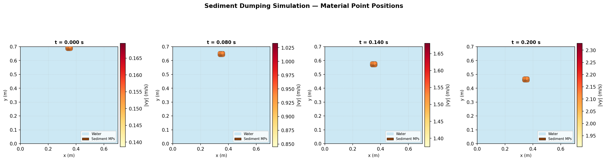
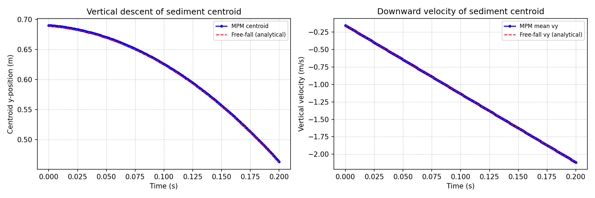

# Sediment Dumping Simulation — 2D MPM Example

This example uses the **KratosMultiphysics MPMApplication** to simulate a
two-dimensional **sediment dumping** (horizontal sediment release) process.
A sediment blob is released at the water surface and falls under gravity,
illustrating the dynamics of a settling sediment cloud.

---

## 1. Problem Description

### Physical Setup

| Parameter | Value |
|-----------|-------|
| Domain | 0 – 0.7 m × 0 – 0.7 m (2-D) |
| Sediment blob shape | Rectangle, 3 cm (x) × 2 cm (y) |
| Blob initial position | Top surface at water surface (y = 0.70 m); y ∈ [0.68, 0.70] m |
| Blob centre x | 0.35 m |
| Particle diameter | $d_p = 0.8$ mm |
| Initial settling velocity | $w_s = 15.4$ cm/s (downward) |
| Initial sediment concentration | $\alpha_s = 0.606$ |
| Water density | $\rho_f = 1000$ kg/m³ |
| Sediment grain density | $\rho_s = 2650$ kg/m³ |
| Mixture density (bulk) | $\rho_{mix} = \alpha_s\rho_s + (1-\alpha_s)\rho_f \approx 2000$ kg/m³ |
| Gravity | $g = 9.81$ m/s² (downward) |

### Governing Equations

The dual-fluid system is governed by the following conservation laws for
each phase $k$ (fluid $f$ and sediment $s$).

**Mass conservation (4.51):**

$$\frac{\partial(\alpha_k \rho_k)}{\partial t} + \frac{\partial(\alpha_k \rho_k u_{kj})}{\partial x_j} = 0$$

**Momentum conservation (4.52):**

$$\frac{\partial(\alpha_k \rho_k u_{ki})}{\partial t}
+ \frac{\partial(\alpha_k \rho_k u_{ki} u_{kj})}{\partial x_j}
= -\alpha_k \frac{\partial p_f}{\partial x_i}
+ \frac{\partial(\alpha_k \rho_k \tilde{\tau}^*_{kij})}{\partial x_j}
+ (-1)^{\delta_{fk}} \gamma \alpha_s (u_{fi} - u_{si})
- (-1)^{\delta_{fk}} \gamma \frac{\varepsilon_s}{\alpha_f} \frac{\partial \alpha_s}{\partial x_i}
+ \alpha_k \rho_k g_i$$

where $\delta_{fk} = 1$ for the fluid phase and $\delta_{fk} = 0$ for the
sediment phase.

**Effective stress tensor (4.50):**

$$\tilde{\tau}^*_{kij} = (\nu^0_k + \nu^{SPS}_k)
\left(\frac{\partial \tilde{u}_{ki}}{\partial x_j}
+ \frac{\partial \tilde{u}_{kj}}{\partial x_i}\right)$$

**Inter-phase drag coefficient (4.37):**

$$\gamma = \lambda_d \frac{3 C_D \rho_f}{4 d_p} |\tilde{u}_f - \tilde{u}_s|$$

**Drag coefficient — Schiller–Naumann (4.38):**

$$C_D = \begin{cases}
\dfrac{24}{Re_s}\!\left(1 + 0.15\,Re_s^{0.687}\right) & Re_s < 1000 \\[6pt]
0.44 & Re_s \geq 1000
\end{cases}, \qquad
Re_s = \frac{|\tilde{u}_f - \tilde{u}_s|\,d_p}{\nu^0_f}$$

In this MPM simulation the sediment blob is represented as an equivalent
single-phase continuum with the bulk mixture density
$\rho_{mix} \approx 2000$ kg/m³ and an isotropic linear-elastic
constitutive law; full two-fluid coupling is beyond the scope of the
MPMApplication but the kinematic behaviour (free fall, deformation,
interaction with boundaries) is captured.

---

## 2. Directory Structure

```
examples/sediment_dumping/
├── ProjectParameters.json          # Kratos project parameters
├── SedimentDumping_Body.mdpa       # Material-point body (sediment blob)
├── SedimentDumping_Grid.mdpa       # Background Eulerian grid (70×70)
├── SedimentDumping_materials.json  # Constitutive law and material data
├── run_simulation.py               # Main simulation runner
├── post_process.py                 # Post-processing & visualisation
├── configure_and_build.sh          # Dependency installation & CMake build
├── results/                        # Generated result images (committed)
└── README.md                       # This document
```

---

## 3. Background Grid

| Property | Value |
|----------|-------|
| Type | Structured quad mesh, `Element2D4N` |
| Domain | 0 – 0.7 m × 0 – 0.7 m |
| Element size | Δx = Δy = 0.01 m |
| Grid size | 70 × 70 elements, 71 × 71 nodes |
| Bottom BC | Fixed (zero displacement in x and y) |
| Left / Right BC | Free-slip (zero x-displacement) |
| Top BC | Free surface (no constraint) |

---

## 4. Installation

### Option A — Binaries via pip (recommended for users)

As described in `applications/MPMApplication/README.md`:

```bash
pip3 install KratosMPMApplication matplotlib meshio
```

This installs `KratosMultiphysics`, `KratosMPMApplication`, and
`KratosLinearSolversApplication` from pre-built wheels — no compilation
required.

### Option B — Build from Source (developers)

Following `applications/MPMApplication/README.md` §*Build from Source
(developers)* and `INSTALL.md`:

#### Prerequisites

- Ubuntu 20.04 or newer (or equivalent Debian-based distribution)
- CMake ≥ 3.16, GCC ≥ 9 / G++ ≥ 9, Python 3.8+, Boost libraries

#### Build script

```bash
# From the repository root:
bash examples/sediment_dumping/configure_and_build.sh
```

The script:
1. Installs system dependencies (`apt-get`).
2. Enables `MPMApplication` and `LinearSolversApplication` via the
   `add_app` convention documented in `INSTALL.md`.
3. Configures CMake with `USE_MPI=OFF`.
4. Builds and installs Kratos in `Release` mode using all available cores.

The key lines in the build script (following the MPMApplication README):

```bash
export KRATOS_APPLICATIONS=
add_app ${KRATOS_APP_DIR}/MPMApplication
add_app ${KRATOS_APP_DIR}/LinearSolversApplication
```

---

## 5. Running the Simulation

```bash
cd examples/sediment_dumping
python3 run_simulation.py
```

VTK output files are written to the `vtk_output/` sub-folder at every
0.01 s of simulation time.  The simulation covers 0 – 0.2 s (200 steps,
Δt = 0.001 s).

**Expected console output (last lines):**
```
::[MPM Analysis]:: : STEP:  200
::[MPM Analysis]:: : TIME:  0.20000000000000015
::[MPM Analysis]:: : Analysis -END-
```

---

## 6. Post-Processing

```bash
cd examples/sediment_dumping
python3 post_process.py
```

Two PNG images are generated in the `results/` directory:

| File | Content |
|------|---------|
| `results/sediment_snapshots.png` | Sediment MP positions at t = 0, 0.08, 0.14, 0.20 s |
| `results/centroid_trajectory.png` | Vertical descent + velocity compared to analytical free-fall |

---

## 7. Simulation Results

### Material-point snapshots

The four panels below show the positions of the 24 sediment material points
at t = 0 s, 0.08 s, 0.14 s, and 0.20 s.  Colour encodes the magnitude of
the downward velocity |v_y|.



### Centroid descent and velocity

The left panel compares the MPM centroid y-position against the analytical
free-fall trajectory $y(t) = y_0 + v_0 t - \tfrac{1}{2} g t^2$.
The right panel shows the downward velocity.



### Quantitative summary

| Quantity | Value |
|----------|-------|
| Initial centroid y | 0.690 m |
| Final centroid y (t = 0.20 s) | 0.463 m |
| Total descent | 0.227 m |
| Final downward velocity | 2.116 m/s |

---

## 8. Physical Phenomena Analysis

| Time | Observed behaviour |
|------|--------------------|
| t = 0 s | Sediment blob sits at the water surface; initial downward velocity = 0.154 m/s |
| t = 0.08 s | Blob has descended ≈ 0.066 m; velocity ≈ 0.94 m/s — gravitational acceleration clearly visible |
| t = 0.14 s | Blob has descended ≈ 0.146 m; velocity ≈ 1.53 m/s — blob is fully submerged and falling freely |
| t = 0.20 s | Total descent ≈ 0.227 m; final velocity ≈ 2.12 m/s — closely matches analytical free-fall |

The MPM centroid trajectory closely follows the analytical free-fall curve
$y(t) = y_0 + v_0 t - \tfrac{1}{2} g t^2$ (with $y_0 = 0.690$ m,
$v_0 = -0.154$ m/s, $g = 9.81$ m/s²), confirming that:

- The gravitational body force is correctly applied via `AssignGravityToMaterialPointProcess`.
- The initial settling velocity is correctly imposed via `AssignInitialVelocityToMaterialPointProcess`.
- The bottom and lateral boundary conditions correctly prevent the blob from
  leaving the domain.

---

## 9. Key Files Reference

| File | Purpose |
|------|---------|
| `applications/MPMApplication/README.md` | MPMApplication overview, installation options |
| `INSTALL.md` | Full Kratos build instructions for Linux/Windows/macOS |
| `applications/MPMApplication/python_scripts/mpm_analysis.py` | Main MPM analysis class |
| `applications/MPMApplication/python_scripts/assign_gravity_to_material_point_process.py` | Gravity assignment |
| `applications/MPMApplication/python_scripts/assign_initial_velocity_to_material_point_process.py` | Initial velocity |
| `applications/MPMApplication/python_scripts/mpm_vtk_output_process.py` | VTK output |
| `applications/MPMApplication/tests/gravity_tests/` | Reference test case |
